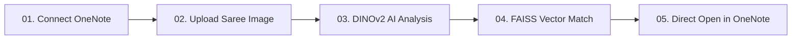

# AI Saree Design Search 🥻✨

> **Find. Reuse. Preserve.**  
> Visual motif & pattern retrieval engine for saree manufacturers, weavers, and textile designers — integrated with Microsoft OneNote.

Developed by **[Jiya Vinchhi](https://github.com/jiyavinchhi123)**

---

## 🌟 Overview

**AI Saree Design Search** allows textile designers, weavers, and manufacturing teams to discover existing saree designs across Microsoft OneNote notebook archives in seconds. 

By utilizing self-supervised computer vision, the engine analyzes motifs, borders, pallu geometry, and weave density — **completely invariant to fabric color variations**. A pink saree with gold zari peacock buttis will accurately match the same historical design cataloged in green, black, or royal blue.

---

## ✨ Key Features

- **🔍 Smart Color-Independent Matching**: Filters out chromatic variations and extracts pure structural edge tensors and motif geometry.
- **📓 Microsoft OneNote Cloud Sync**: Connects to personal or work Microsoft accounts via Microsoft Graph API with **read-only** permissions (`Notes.Read`, `User.Read`).
- **🎯 Exact-Object Deep Linking**: One-click navigation launches OneNote Online directly focused on the exact notebook, section, and page containing the matched image.
- **⚡ Sub-Second Retrieval**: Powered by Meta's **DINOv2** (Self-Supervised Vision Transformer) and **FAISS** (Facebook AI Similarity Search) index.
- **🎛️ Real-Time Confidence Slider**: Dynamically adjust match confidence thresholds from 50% to 100% without re-running neural extraction.
- **📱 Fully Mobile Responsive**: Seamless experience across smartphones, tablets, laptops, and 4K displays with a responsive navigation drawer.
- **📊 Search Audit Log**: Keeps a clean history of uploaded design queries, confidence percentages, and OneNote matched records.

---

## 🔄 How It Works



1. **01 — Connect OneNote**: Link your Microsoft account to scan and index textile design notebooks.
2. **02 — Upload Image**: Upload a saree photograph, pallu close-up, border swatch, or loom sketch.
3. **03 — AI Analysis**: DINOv2 neural model extracts structural motif and border tokens without color bias.
4. **04 — Find Match**: FAISS vector index retrieves closest matching designs with percentage confidence.
5. **05 — Open in OneNote**: One click opens the exact matched design page in OneNote Online.

---

## 🛠️ Technology Stack

### Frontend
- **Framework**: React 18 + Vite
- **Styling**: Vanilla CSS Design System (Ivory/White canvas, Slate typography, Royal Purple accents, Gold Zari highlights)
- **Icons**: Lucide React

### Backend & AI Vision
- **Framework**: FastAPI + Uvicorn
- **Vision Transformer**: Meta DINOv2 (`dinov2_vits14`)
- **Image Processing**: OpenCV (CLAHE luminance normalization, Sobel edge gradients)
- **Vector Search**: FAISS (`faiss-cpu`)
- **Authentication**: MSAL (Microsoft Authentication Library for Graph API)
- **Database**: SQLite / SQLAlchemy

---

## 🚀 Getting Started Locally

### Prerequisites
- Python 3.10+
- Node.js 18+ & npm
- Git

### 1. Clone Repository
```bash
git clone https://github.com/jiyavinchhi123/AI-Saree-Design-Search.git
cd AI-Saree-Design-Search
```

### 2. Backend Setup
```bash
cd backend
python -m venv venv

# Windows
.\venv\Scripts\activate
# macOS/Linux
# source venv/bin/activate

pip install -r requirements.txt
python run.py
```
> The backend server starts on `http://127.0.0.1:8000`.

### 3. Frontend Setup
In a new terminal window:
```bash
cd frontend
npm install
npm run dev
```
> The frontend application starts on `http://localhost:5173`.

---

## 🌐 Cloud Deployment (Render + Vercel)

### Backend on Render (Free Web Service)
1. Go to [render.com](https://render.com) and create a **New Web Service**.
2. Connect your GitHub repository.
3. Configure:
   - **Root Directory**: `backend`
   - **Runtime**: `Python 3`
   - **Build Command**: `pip install -r requirements.txt`
   - **Start Command**: `uvicorn app.main:app --host 0.0.0.0 --port $PORT`
4. Deploy and copy your Render URL (e.g. `https://your-backend.onrender.com`).

### Frontend on Vercel
1. Go to [vercel.com](https://vercel.com) and import the repository.
2. Configure:
   - **Root Directory**: `frontend`
   - **Framework Preset**: `Vite`
3. Add Environment Variable:
   - `VITE_API_URL` = `https://your-backend.onrender.com`
4. Click **Deploy**.

---

## 🔐 Microsoft OneNote Authentication

The application supports two secure Microsoft Graph authentication methods:
1. **1-Click Device Code Flow**: Works on any domain, mobile device, or local port without configuring Azure redirect URIs (`https://microsoft.com/devicelogin`).
2. **Direct OAuth 2.0 Web Flow**: Standard authorization redirect for single-domain setups.

> **Privacy & Security**: The app requests only `Notes.Read` and `User.Read`. Your original OneNote notebooks and pages are **never modified, overwritten, or deleted**.

---

## 📄 License & Credits

Developed by **Jiya Vinchhi**  
© 2026 AI Saree Search. All rights reserved.
